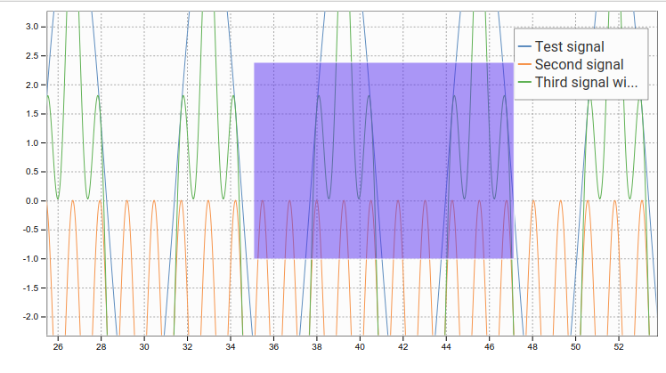
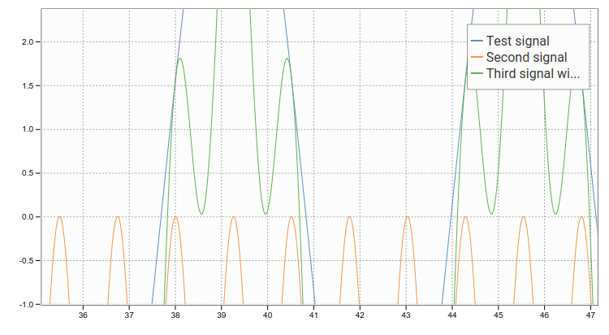

# react-d3-plot

react-d3-plot is a library that provides components for easy drawing graphs. Currently ploting, box zooming and legend drawing is implemented.

## Implemented features

- Line ploting
- Left and bottom axis drawing
- Legend
- Box zooming
- Un zooming (double-click)
- Figure title
- X axis label
- Y axis label

## Features I am planning to implement

- Pan
- Point ploting
- Hidding/showing signals
- Maximize option
- Styles
- Logarithmic axes

## Documentation

## Create a sample project

Sample using npm and create-react-app.

~~~shell
create-react-app react-d3-plot-sample
cd react-d3-plot-sample
npm install --save d3 react-d3-plot
~~~

Edit src/app.js
~~~javascript
import React, { Component } from 'react';
import './App.css';
import { Plot } from 'react-d3-plot';

class App extends Component {
  render() {
    const xData = Array.from(new Array(10000), (val, index)=>index*0.01);
    const signals =  [
      {
        name: 'Test signal',
        xData: xData,
        yData: xData.map((value)=>5*Math.sin(value))
      },
      {
        name: 'Second signal',
        xData: xData,
        yData: xData.map((value)=>2*Math.sin(value*5)-2)
      },
      {
        name: 'Third signal',
        xData: xData,
        yData: xData.map((value)=>2*Math.sin(value*5)-2+5*Math.sin(value))
      }
    ];
    return (
      

        <Plot signals={signals}/>
      

    );
  }
}

export default App;
~~~

Show the graph:

~~~shell
npm start
~~~

## License

MIT
